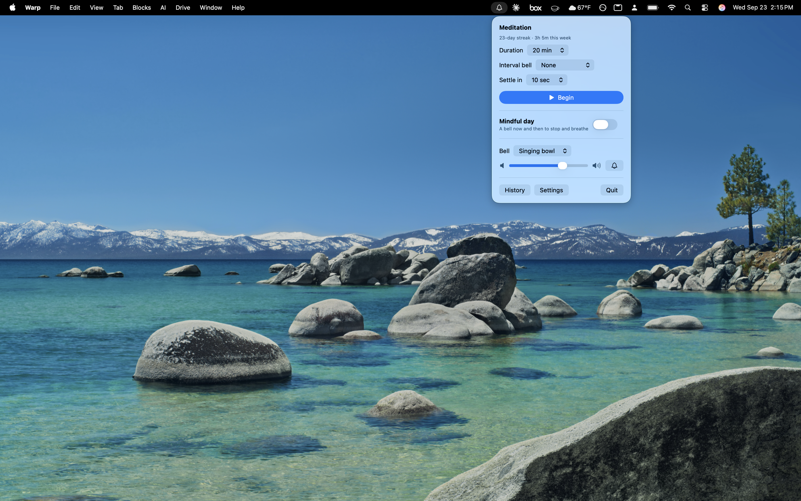

# Stillpoint

Free and open source. Previously called Mindful Bell; the repository, Xcode target and bundle ID keep that name.

A macOS menu bar app with a meditation timer, session history, and bells to bring you back to the present during the day.

- **Meditation**: choose a length, optional interval bells, and a short quiet time before the opening bell. One bell starts the sit, three bells end it. The menu bar shows the time remaining, and the Mac stays awake while you sit.
- **History**: every sit of a minute or more is saved. The History window shows your current and longest streaks, time sat, minutes per day for the last 30 days, and each sit (select one and press Delete to remove it).
- **Mindful day**: a single bell every so often, at regular or varied times, only during the hours you pick. It stays quiet during a sit, and any bell that came due while the Mac was asleep is skipped.
- **Shortcuts and Siri**: actions for Start Meditation (with an optional length; outputs when it will end), End Meditation, Ring Bell, Set Mindful Day and Get Meditation Minutes. Siri and Spotlight phrases work without any setup, e.g. "Start meditating with Stillpoint".
- **Focus**: add the Stillpoint filter to a Focus in System Settings › Focus to silence Mindful Day bells, or start a sit, while that Focus is on. In the app's Settings you can also name shortcuts to run when a sit begins and ends, e.g. to turn Do Not Disturb on and off.
- **Bells**: singing bowl, temple bell, or small chime, generated from each bell's vibration modes (no audio files). `previews/` has WAV renders of each; they are not part of the app.

Requires macOS 14 (Sonoma) or later. Everything is free: no purchases, accounts or network access.



## Install

1. Download **Stillpoint.zip** from the [latest release](https://github.com/poglesbyg/MindfulBell/releases/latest), unzip it, and drag Stillpoint to Applications.
2. Open it. Stillpoint isn't notarized by Apple, so macOS blocks it the first time: click **Done**, then go to **System Settings › Privacy & Security**, scroll down, and click **Open Anyway** next to Stillpoint. You only need to do this once. (Or run `xattr -dr com.apple.quarantine /Applications/Stillpoint.app` in Terminal.)
3. Look for the bell in the menu bar.

Or with [Homebrew](https://brew.sh):

```
brew tap poglesbyg/stillpoint https://github.com/poglesbyg/MindfulBell
brew install --cask poglesbyg/stillpoint/stillpoint
```

The first launch still needs **Open Anyway**, as above. `brew upgrade` picks up new versions.

Help and the privacy policy: https://poglesbyg.github.io/stillpoint/

## Build and run

Needs Xcode 16 or later.

1. Open `MindfulBell.xcodeproj`.
2. Select the **MindfulBell** target › **Signing & Capabilities** and pick your team, or choose **Sign to Run Locally** if you don't have one.
3. Press ⌘R. Look for the bell in the menu bar.

Every file inside the `MindfulBell/` folder is part of the target automatically; new files you add there are picked up without editing the project.

### Turning Do Not Disturb on while you sit

Apps can't switch Focus modes directly, so use a shortcut:

1. In Shortcuts, make a shortcut named **Sit Focus On** containing *Set Focus*: turn Do Not Disturb on. Make **Sit Focus Off** that turns it off.
2. In Stillpoint › Settings, enter those names under *Run a shortcut*.

The app runs them through the Shortcuts app, which may come to the front briefly.

## Screenshot demo mode

For screenshots, run with sample data:

1. Product › Scheme › Edit Scheme › Run › Arguments, and tick `-StillpointDemo YES`.
2. Run (⌘R). History shows about ten weeks of practice with a three-week streak.

Demo mode never reads or writes your real `history.json` (sits you do during a demo aren't kept). It exists only in Debug builds, so release builds can't enter it. **Untick the argument afterwards**, or History will keep showing the sample data.

`AppStore/screenshots/final/` holds the finished screenshots (2880×1800, plain and captioned), built from the raw captures with `python3 AppStore/make_screenshots.py --fonts <folder with Inter-SemiBold.ttf>`.

## Releasing

`.github/workflows/build.yml` builds the app on every push and pull request. To publish a version, tag it and push the tag:

```
git tag v1.0
git push origin v1.0
```

The workflow builds the Release configuration with that version number, ad-hoc signs it, and attaches `Stillpoint.zip` to a new GitHub Release with `.github/release-notes.md` as the notes. It then updates the version and checksum in `Casks/stillpoint.rb` on `main`, so Homebrew users get the new version too. It isn't notarized, which needs a paid Apple Developer account; that's why first launch needs **Open Anyway**.

Already in place: App Sandbox, Hardened Runtime, the app icon, a privacy manifest (`PrivacyInfo.xcprivacy`, declaring UserDefaults use and no data collection), the copyright line, and no network access.

## Layout

| File | Purpose |
|---|---|
| `MindfulBellApp.swift` | App entry point, menu bar icon, History and Settings windows |
| `ContentView.swift` | The panel that opens from the menu bar |
| `BellController.swift` | Session timing, reminder scheduling, Focus handling, saved settings |
| `HistoryStore.swift` | Saved sits (`~/Library/Containers/<bundle id>/Data/Library/Application Support/Mindful Bell/history.json`) and streak statistics |
| `HistoryView.swift` | History window |
| `SettingsView.swift` | Settings window |
| `Intents.swift` | Shortcuts actions, Siri phrases, Focus filter |
| `BellSynth.swift` | Bell sound generation and playback |
| `AppStore/make_icon.py` | Draws the app icon and writes every size into the asset catalog (`python3 AppStore/make_icon.py`, needs Pillow) |

## License

MIT. See `LICENSE`.
